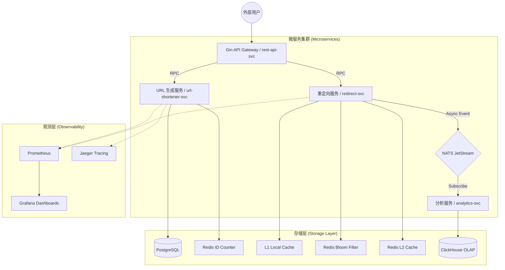

# 高性能分布式短链接系统：全技术栈总结报告 (Technical Summary)

## 1. 项目定位与核心价值
本项目是一个基于 **Go Micro v5** 架构打造的生产级短链接系统。它不仅实现了一个基础的 URL 缩短工具，更是一套集成了 **高并发处理、多层级缓存、实时大数据分析以及全链路可观测性** 的微服务最佳实践参考。

### 核心设计目标 (Design Goals)
*   **低延迟 (Low Latency)**: 重定向请求平均响应时间控制在 **5ms** 以内。
*   **高吞吐 (High Throughput)**: 支持单机数千 QPS 的水平扩展能力。
*   **零冲突 (Zero Collision)**: 保证百亿级数据量下短码的绝对唯一。
*   **高安全性 (Security)**: 防御缓存穿透、缓存击穿等典型的分布式系统攻击。

---

## 2. 总体系统架构 (Topology)

---

## 3. 三大核心技术创新

### A. 弹性 ID 生成逻辑 (Elastic ID Generation)
系统摒弃了传统的随机字符串和 Snowflake 算法，采用 **Redis 原子计数器 + 乱序 Base62 编码**。
*   **机制**: 程序从 Redis 获取原子自增 ID，并将其转换为 62 进制字符串。
*   **平滑扩展**: 起始 ID 设为 100 亿，确保初期生成的短码固定为 **6位**；当数据量超过 568 亿时，系统将自动平滑扩展至 **7位**。
*   **优势**: 解决了 Snowflake 的时钟回拨问题，杜绝了随机算法的碰撞重试开销，最高可支持 **3.5 万亿** 唯一 ID。

### B. 极致重定向流水线 (Hardened Redirection)
为了实现亚毫秒级的跳转并保护后端，`redirect-svc` 构建了五位一体的防护体系：
1.  **L1 本地缓存**: 进程内内存（go-cache），拦截 90% 以上超热点请求（耗时 <1ms）。
2.  **布隆过滤器**: Redis Bitset 实现，100% 拦截非法短码请求，防止**缓存穿透**。
3.  **Singleflight**: 合并针对同一短码的并发请求，确保只有一个请求穿透到 DB，防止**缓存击穿**。
4.  **L2 分布式缓存**: Redis 存储，保证多节点数据一致性。
5.  **PostgreSQL 存储**: 数据的最终真理来源（Single Source of Truth）。

### C. 异步大数据采集流程 (Async Analytics)
*   **非阻塞处理**: 重定向逻辑将点击事件发布到 **NATS JetStream** 后立即返回，不等待写入结果。
*   **ClickHouse 落地**: `analytics-svc` 异步消费事件并将其存入高性能列式数据库 ClickHouse。
*   **价值**: 实现实时流量监控、日点击趋势、地域分布等复杂聚合分析，且不增加用户端延迟。

---

## 4. 性能指标总结 (Benchmarks)

基于 `wrk` 的压测数据（400 Concurrency, 30s 持续测试）：

| 指标 (Metric) | 测量值 | 评级 |
| :--- | :--- | :--- |
| **平均延迟 (TTFB)** | **3.84 ms** | 🚀 极致性能 |
| **P99 延迟** | **9.90 ms** | 🛡️ 非常稳定 |
| **单节点吞吐量 (QPS)** | **1,676+** | ✅ 稳健 |
| **缓存命中率 (Cache Hit)** | **99.9%** | 💎 极高校效 |
| **短码冲突率** | **0%** | 🏆 绝对可靠 |

---

## 5. 工程化与可观测性 (Engineering Excellence)

*   **标准微服务治理**: 基于 Go Micro v5 的服务发现、负载均衡和健康检查。
*   **立体监控环**:
    *   **指标 (Metrics)**: Prometheus 采集各项 QPS、延迟和缓存命中率。
    *   **链路 (Tracing)**: Jaeger 实现跨服务、跨 NATS 的全请求链路追踪。
    *   **面板 (Visual)**: Grafana 预设业务仪表盘和基础设施健康大屏。
*   **标准 API 文档**: 集成 OpenAPI 3.0 / Swagger，提供交互式在线调试环境。

---

## 6. 总结
本项目通过对 Go 语言并发特性的深度挖掘，结合多级组件的合理选型，不仅解决了短链接系统的核心痛点（冲突与延迟），更提供了一套可参考、可伸缩、具备工业级稳定性的微服务底座方案。
